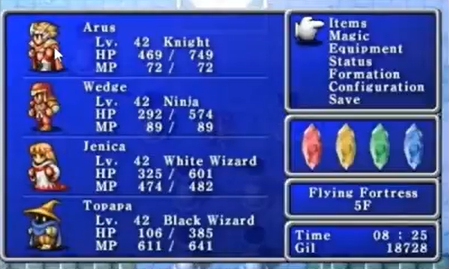

# Abstração de um jogo RPG 🎮
## Jogo Final Fantasy🎮, abstração de personagens usando o paradigma da orientação a objetos

# Finalizado o desafio, foram criadas as propriedades conforme o desenho, e implementado o método ataque, sendo que o usuario deve passar como parametro o nome do inimigo que deseja atacar, ao atacar perde-se 10 MagicPoints e o inimigo perde 20 HealthPoints, além disso foi implementado também um Enum com os tipos de personagens possiveis conforme a imagem.